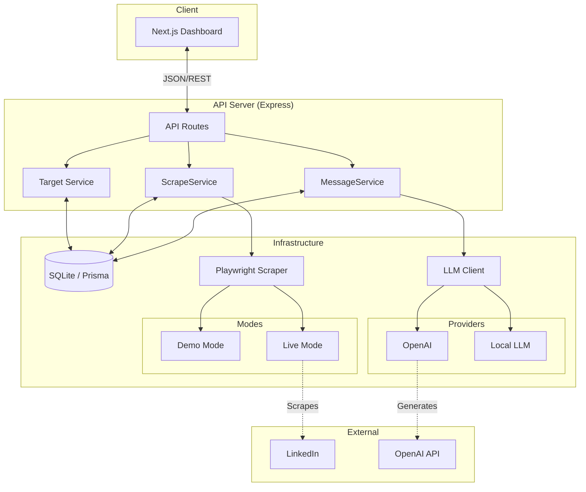
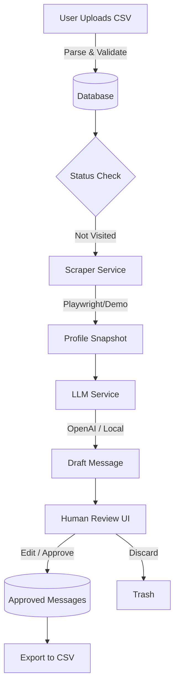

# Prema LinkedIn Outreach Engine

A safe, AI-assisted outreach engine that scrapes profiles, generates personalized LinkedIn message drafts, and enforces human-in-the-loop review.

> Built by **Prema Vision LLC**, an AI automation consultancy led by **Denys Korolkov**.

## ⭐ Live Demo

- **Web UI:** [https://prema-linkedin-outreach.vercel.app](https://prema-linkedin-outreach.vercel.app)
- **API docs:** [https://prema-linkedin-outreach.onrender.com/docs](https://prema-linkedin-outreach.onrender.com/docs)

## ⭐ Video Walkthrough


(Full workflow walkthrough: scraping → personalization → human approval → export.)

## ⭐ Screenshots


---

## Elevator Pitch

Most outreach tools force a choice between slow manual work and risky spam bots. This engine provides the **middle path**: it automates data collection and initial drafting while enforcing human review for quality and safety. Designed for high-touch B2B sales and recruiting, it scales personalization without sacrificing reputation.

## Why This Project Matters

Sales and recruiting teams waste countless hours copy-pasting profile data into ChatGPT or writing generic messages that get ignored. Fully automated bots often hallucinate or send inappropriate messages, risking account bans.

This project solves the **"Spam vs. Scale"** dilemma by:
1.  **Automating research:** Scraping profile data invisibly.
2.  **Scaling personalization:** Using LLMs to write relevant drafts based on bio, experience, and recent posts.
3.  **Enforcing safety:** No message leaves the system without a human click.

## Core Features

-   **Intelligent Profile Scraping**: Playwright-based scraper that extracts bio, experience, and activity (with a Demo mode for offline testing).
-   **AI Personalization Engine**: Generates unique connection requests and InMails using OpenAI or local LLMs.
-   **Human-in-the-Loop Dashboard**: A clean, dedicated Next.js dashboard to review, edit, approve, or discard drafts before they are queued.
-   **Safe Automation Patterns**: Configurable delays, user-like pacing, session reuse, and request fingerprinting to mimic natural browsing behavior.
-   **CSV Pipeline**: Simple import of targets and export of approved messages for final delivery.

> **Note:** All scraping is intended for demo/testing. Respect LinkedIn’s terms of service when using real data.

## Architecture Overview

Each domain (Targets, Scraping, Messaging) is isolated behind a dedicated service module, making it easy to extend or replace components without touching the rest of the system.



## Data Flow / AI Flow



## Tech Stack

### Backend & Core
-   **Runtime**: Node.js 20+ (ES Modules)
-   **Framework**: Express.js
-   **Database**: SQLite (via Prisma ORM) — easily swappable for PostgreSQL
-   **Language**: TypeScript (Strict mode)

### Automation & AI
-   **Scraping**: Playwright (Headless browser automation)
-   **LLM Integration**: OpenAI API (GPT-4o/GPT-3.5) with abstract provider pattern for local LLM fallbacks.
-   **Queueing**: In-memory job processing (extensible to BullMQ).

### Frontend
-   **Framework**: Next.js 14 (App Router)
-   **Styling**: Tailwind CSS
-   **State**: React Server Components + Client Hooks

## Setup & Running

### 1. Clone and Install
```bash
git clone https://github.com/your-repo/prema-linkedin-outreach.git
cd prema-linkedin-outreach
npm install
```

### 2. Environment Configuration
Copy the example environment file and configure your API keys.
```bash
cp .env.example .env
```
*Set `SCRAPER_MODE=demo` to run without LinkedIn credentials.*

### 3. Database Migration
Initialize the local SQLite database.
```bash
npm run prisma:migrate
```

### 4. Run the Application
Start both the Backend API and the Frontend UI.
```bash
npm run dev
```
-   **UI**: http://localhost:3000
-   **API**: http://localhost:4000

## How to Use (Step-by-Step Demo Flow)

1.  **Import Targets**: Go to the dashboard and upload a CSV file containing LinkedIn URLs (see `data/demo_batch_1.csv`).
2.  **Preview Target**: Click on a target to view details before scraping.
3.  **Scrape Profiles**: Click "Scrape" on a target. In `demo` mode, this loads a pre-saved snapshot instanty. In `playwright` mode, it launches a browser to visit the profile.
4.  **Generate Drafts**: The system automatically triggers the LLM to write a connection request based on the scraped bio and the offer context you provide.
5.  **Review & Refine**:
    -   **Approve**: If the message looks good.
    -   **Edit**: Tweak the text manually.
    -   **Regenerate**: Ask the AI to try again.
6.  **Export**: Once you have a batch of approved messages, click "Export CSV" to get a file ready for your sending tool (or manual processing).

## API Examples

The system exposes a RESTful API for integration.

### Import Targets
```bash
curl -X POST http://localhost:4000/targets/import \
  -F "file=@./data/targets.csv"
```

### Generate Message
```json
POST /targets/1/generate
{
  "offerContext": "We help SaaS founders scale engineering teams...",
  "count": 2
}
```

### Export Approved
```bash
GET http://localhost:4000/export/approved
```

## Who This Is For

-   **Founders & CTOs** building internal growth tools.
-   **AI Automation Agencies** looking for a solid starting point for client projects.
-   **Sales Operations Leaders** who need more control than standard outreach tools provide.

## Extensibility & Future Enhancements

The architecture is built to be extended:

-   **Multi-LLM Support**: Easily swap OpenAI for Anthropic Claude or a local Llama 3 model via the `LLMClient` interface.
-   **CRM Integration**: Add a `CRMService` adapter to sync approved leads directly to HubSpot or Salesforce.
-   **Advanced Scraping**: The `Scraper` interface supports adding new strategies (e.g., API-based vendors like Proxycurl) without changing core logic.
-   **Vector Embeddings**: Optional integration-ready architecture for RAG-enhanced personalization.

## Contact

For collaboration, consulting, or questions:

**Denys Korolkov** — Prema Vision LLC

If you'd like a customized outreach engine or AI automation for your workflow, feel free to reach out.

📧 [denys@premavision.net](mailto:denys@premavision.net)

🌐 [https://premavision.net](https://premavision.net)
